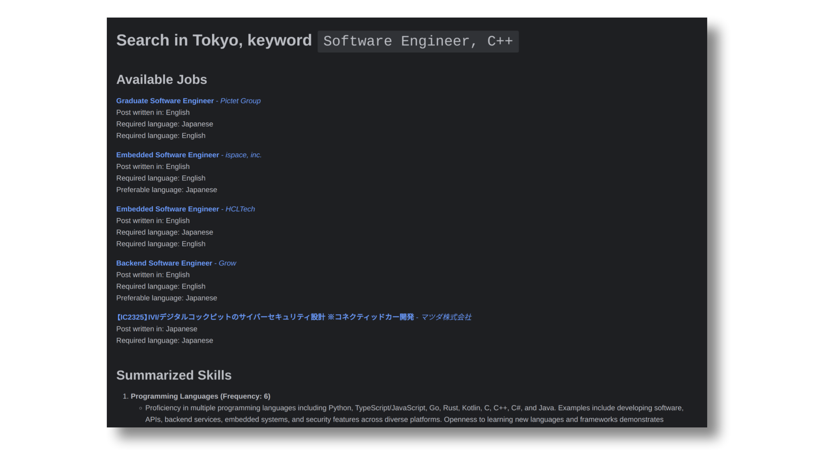
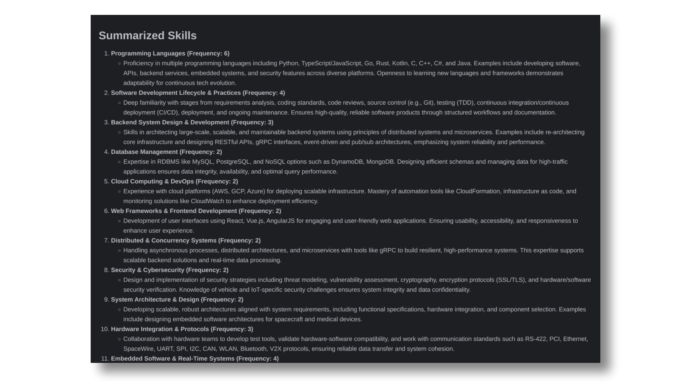

<br>

<p align="center" width="100%">
    </a>
    <br>Automated job scraper and skills summarization
</p>

<br>


# Overview

This project provides a robust pipeline for automated extraction and analysis of job postings from LinkedIn. 
It combines web scraping with LLMs to compile structured reports summarizing job requirements, 
skills, and language expectations for specified roles and locations. Results are compiled into a Markdown 
report for downstream review or further processing.

> [!NOTE]
> The project uses OpenAI models, so an OpenAI API key is needed.

Practical example: the output of a search for `Software Engineer, C++` in `Tokyo` is the following `output.md`. 
The first section is just the collection of jobs (the default number of jobs to process is `5`):

</a>

Following, a section with all the skills summarized:

</a>

Lastly, there is again the same collection of jobs, but with the specific requirements for each job.

</a>

# How to run

> [!NOTE]
> A valid OpenAI API key is needed.

## Installation

1. Clone the repository:
   ```bash
   git clone https://github.com/yourusername/llm-linkedin-insights.git
   cd llm-linkedin-insights
   ```

2. (Optional) Set up a Python virtual environment:
    ```bash
   python3 -m venv venv
   source venv/bin/activate
   ```

3. Install requirements:
   ```bash
   pip install -r requirements.txt
   ```

4. Configure your API key and search preferences:
   Edit `main.py`:
     - set the OpenAI API KEY in the `API_KEY` variable
     - optionally change the `city`, `keyword`, and `FIRST_N_JOBS_TO_PROCESS` variables

## Usage

Execute the main script:
```cmd
python main.py
```

Upon completion, the report will be written to `output.md` in markdown format.

# Customization

- **Locations:** Supported cities/countries and their LinkedIn geo IDs are preconfigured and easily extendable in `main.py`.
To add a new location: go to LinkedIn; look for a random job in the specified location; copy the `geoId` present in the URL; add the copied `geoId` to the dictionary in `main.py`.
- **Report Structure:** Output formatting can be modified in the utilities module to support other formats or data fields as needed.
- **LLM Integration:** Prompt templates can be customized to adapt extraction or summarization methods for different domains or requirements (see `src/system_msgs.py`).
